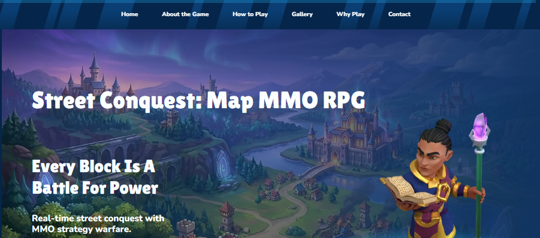
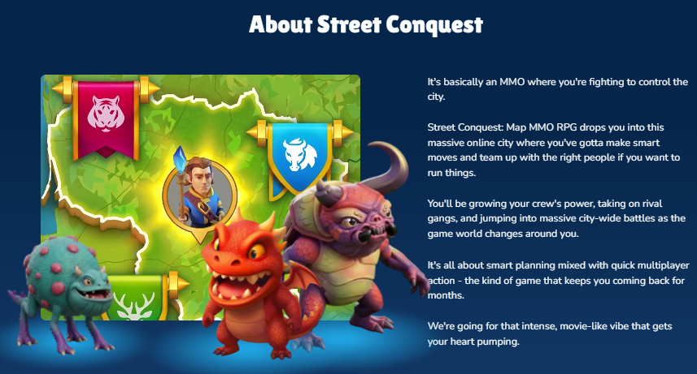
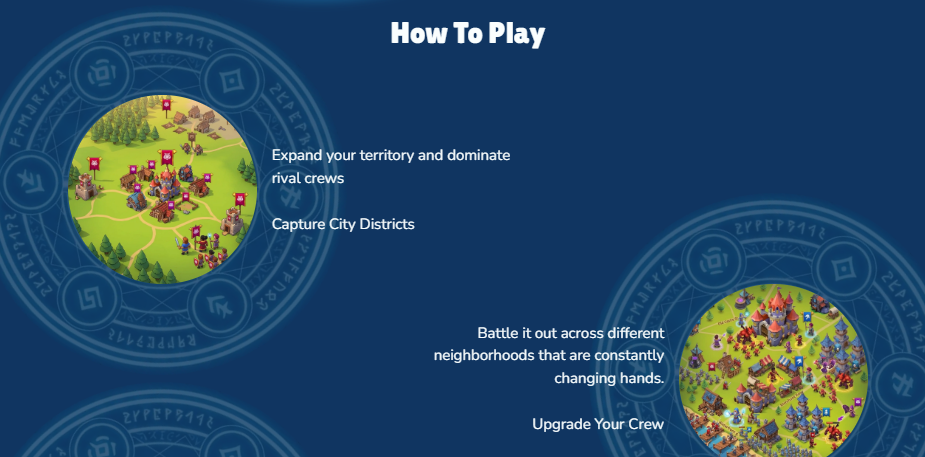
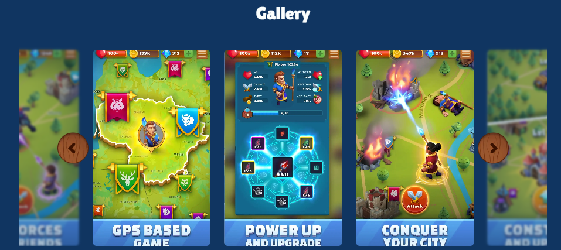
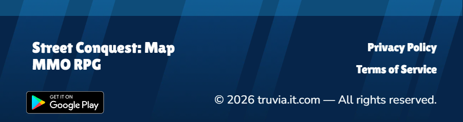

# Street Conquest: Map MMO RPG — Landing Page


A fully responsive promotional landing page for **Street Conquest: Map MMO RPG** — a GPS-based mobile MMO strategy game where players expand their territory, capture city districts, and battle rival crews in real time on a live map.

🔗 **Repository:** [github.com/Anna-Ivanchenko/STP-13026](https://github.com/Anna-Ivanchenko/STP-13026)

---

## 📖 About the Project

Street Conquest is marketed as a real-world map-based MMO RPG, blending GPS strategy gameplay with an intense, movie-like atmosphere. This project delivers the game's marketing website — the first touchpoint for potential players — built entirely with vanilla **HTML, CSS, and JavaScript**.

The site is structured into clear, navigable sections: Home, About the Game, How to Play, Gallery, Why Play, and Contact — each designed to highlight a different aspect of the gameplay experience.

---

## 🏠 Home

The hero section introduces the game with bold typography, atmospheric artwork, and a clear tagline — setting the tone before the user scrolls further.



---

## 🎮 About the Game

A dedicated section explaining the core game loop: fighting for control of the city, teaming up with the right allies, growing crew power, and taking on rival gangs in large-scale, evolving city-wide battles.



---

## 🗺️ How to Play

Breaks down the core mechanics for new players — expanding territory, capturing city districts, battling across constantly shifting neighborhoods, and upgrading your crew.



---

## 🖼️ Gallery

An interactive image carousel showcasing real in-game screens: the GPS-based world map, the crew power-up system, and city conquest combat.



---

## 📩 Footer & Contact

A clean footer with quick links to the Privacy Policy, Terms of Service, and the Google Play download link.



---

## 🛠️ Tech Stack

- **HTML5** — semantic page structure
- **CSS3** — responsive layout, flexbox-based design, styled components
- **JavaScript** — interactive gallery carousel, navigation behavior

---

## 📂 Project Structure

```
STP-13026/
├── index.html
├── css/
│   └── styles.css
├── js/
│   └── main.js
├── assets/
│   └── images/
└── README.md
```

---

## 🚀 Getting Started

Clone the repository and open `index.html` directly in your browser — no build tools required:

```bash
git clone https://github.com/Anna-Ivanchenko/STP-13026.git
cd STP-13026
open index.html
```

---

## 👩‍💻 Author

**Anna Ivanchenko**
[GitHub](https://github.com/Anna-Ivanchenko)
